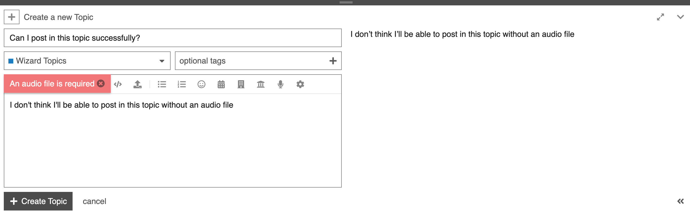

# Validate Audio Files

A component that ensures audio files are uploaded in certain pre-defined categories in order to successfully submit posts. If an audio file is not present, an error tip is shown.

